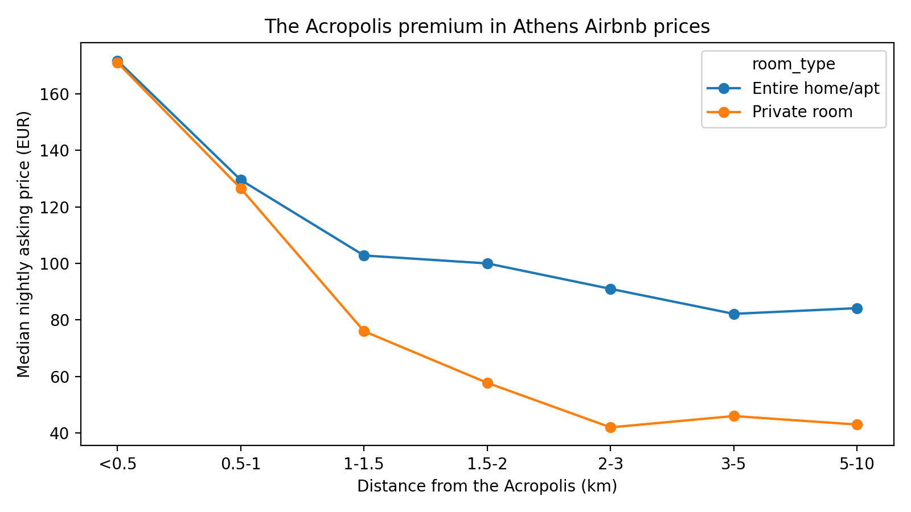

# What sets the price of an Athens Airbnb?

A machine learning model that predicts nightly asking prices for 14,000 Athens Airbnb listings and measures how much being close to the Acropolis is worth, by room type.



## Key finding

An entire home within 500 m of the Acropolis asks a median of **EUR 172 a night**, about **twice** the EUR 82 asked 3 to 5 km away. Most of that premium disappears in the first 1.5 km. Past 3 km, distance barely matters.

Private rooms drop off even faster: from EUR 126 at 0.5 to 1 km down to about EUR 42 by 2 to 3 km.

## Results

Test set of 2,681 listings from hosts the model never saw during training.

| Model | MAE (EUR) |
|---|---|
| Baseline: median price for the same neighbourhood and room type | 50.29 |
| Random Forest | **34.07** |
| LightGBM | 34.21 |

Both models cut the baseline error by about a third. Random Forest and LightGBM are effectively tied.

About 6.8% of entire homes (887 of 13,033) with 10+ reviews ask at least 40% less than the model predicts for similar listings. These are *possibly* underpriced, not proven to be.

## Approach

- **Data:** Inside Airbnb detailed listings for Athens, scraped 29 June 2026. Prices in EUR.
- **Features:** size (guests, bedrooms, bathrooms), location (distance to the Acropolis and Syntagma, neighbourhood), quality (review scores, superhost) and host behaviour (portfolio size, availability, minimum nights).
- **No leakage:** `estimated_revenue_l365d` and the `price_quote_*` columns are calculated from price, so they are dropped before modelling.
- **Target:** log of nightly price, so errors are relative rather than dominated by luxury listings.
- **Split by host:** multi-listing hosts often reuse the same price, so a random split would leak and inflate scores. Each host sits entirely in train or in test.
- **Baseline first:** a model only counts if it beats the median price of similar listings.

## Limitations

- These are **asking prices** set by hosts, not prices guests paid. The model learns what similar hosts ask, not what the market accepts.
- One snapshot in time, so no seasonality.
- 286 of 14,337 listings removed: 138 with no price, 148 below EUR 20 or above the 99th percentile (EUR 730).
- Thin samples: only 23 private rooms within 500 m of the Acropolis, and only 19 hotel rooms in the test set. Treat those numbers with caution.
- `instant_bookable` is blank for every listing in this scrape, so it is not used.
- The underpriced check covers entire homes only. Shared and hostel rooms are priced per bed, which the model reads as a large apartment.

## Run it

```bash
git clone https://github.com/georgegiannakidis/athens-airbnb-pricing.git
cd athens-airbnb-pricing
python3 -m venv .venv && source .venv/bin/activate   # Windows: .venv\Scripts\activate
pip install -r requirements.txt
# download data/listings.csv as described in data/README.md
jupyter notebook notebooks/01_athens_price_model.ipynb
```

## Structure

```
data/            listings.csv goes here (not committed)
notebooks/       the full analysis, with outputs
src/features.py  cleaning, feature and leakage helpers
reports/figures/ charts used in this README
```

## Data source and credit

Data from [Inside Airbnb](https://insideairbnb.com/), shared under a Creative Commons Attribution 4.0 license. Check the site for current terms.

## About me

Built by George Giannakidis. Ten years in hotel distribution technology at WebHotelier, now doing an MS in Computer Science at the University of Hartford.
