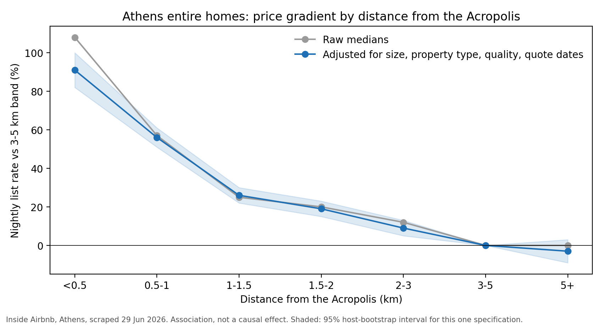

# The Acropolis premium in Athens Airbnb prices

[](https://github.com/georgegiannakidis/athens-airbnb-pricing/actions/workflows/tests.yml)

**[Try the live estimator](https://georgegiannakidis.github.io/athens-airbnb-pricing/)** · [Model card](MODEL_CARD.md) · [Data protection note](DATA_PROTECTION.md) · [Methods](METHODS.md)

> Airbnb homes within 500 m of the Acropolis ask **77% to 92% more** per night than similar homes 3 to 5 km away.

## In plain words

I used public data on about 14,000 Airbnb homes in Athens to answer one question: how much does being close to the Acropolis add to the nightly price?

To keep the comparison fair, I compared homes that are alike in size, type and guest reviews. I also trained standard machine learning models to predict a home's price, and measured how close they get.



## What I found

1. **Location matters a lot, but only up close.** Within 500 m of the Acropolis, prices are 77% to 92% higher. At 1.5 km the extra is about 25%. Beyond 3 km, distance hardly matters.
2. **The models are useful, not perfect.** They are about 30% more accurate than a simple guess (the typical price for the same neighbourhood and room type). On average they miss by about EUR 35 a night.
3. **Two standard models tied.** Random Forest and LightGBM gave almost the same results.
4. **Very cheap and very expensive homes are hard to predict.** Under EUR 60 a night, the model guesses too high, and I have not found the reason yet.

This shows a link between location and price. It does not prove that location is the cause. Views or renovations, which the data does not capture, may also play a part.

## How I kept it honest and safe

- **Fair testing.** Each model is always tested on homes it has never seen. All homes from the same host stay together, so the model cannot copy one host's prices from training into testing.
- **No peeking at the answer.** Automatic tests check the list of inputs each model is trained on. The build fails if the price, or any column known to be calculated from it, is on that list.
- **Privacy.** Public host data is still personal data under GDPR. I used no names, photos or profile text, and the public map shows only areas with 5 or more homes, never a single home. See the [data protection note](DATA_PROTECTION.md).
- **Clear limits.** The [model card](MODEL_CARD.md) says what the model should and should not be used for.

## Try it

Open the [live estimator](https://georgegiannakidis.github.io/athens-airbnb-pricing/). Pick a spot on the map, describe a home, and get an estimated nightly price. It runs entirely in your browser, so nothing you enter is sent anywhere.

## What this project is, and is not

- **About location, not season.** Most price quotes are for June and July 2026, and dates are used only as a background control.
- **About asking prices, not paid prices.** The data shows what hosts ask, not what guests actually paid.
- **Standard models on purpose.** No deep learning and no tuning, so the comparison between models stays simple and fair.

## For technical readers

[METHODS.md](METHODS.md) has the full detail: the two price targets, all 22 features, the 5-fold grouped validation, results tables, error by price band, the robustness checks and the full list of limitations.

## Run it

```bash
git clone https://github.com/georgegiannakidis/athens-airbnb-pricing.git
cd athens-airbnb-pricing
python3 -m venv .venv
source .venv/bin/activate
pip install -r requirements.txt
jupyter notebook notebooks/01_athens_price_model.ipynb
```

Download `data/listings.csv` first, as described in `data/README.md`.

Run the tests with `pytest`. They use synthetic data, so no download is needed.

## Structure

```
data/              listings.csv goes here (not committed)
notebooks/         the full analysis, with outputs
src/features.py    targets, features and leakage guard
tests/             unit tests, including checks that no price, target or discount column is a model input
scripts/           notebook builder, demo model export, demo page builder
docs/              the live estimator (GitHub Pages)
reports/figures/   charts used in this README
METHODS.md         full method, features, validation and results
MODEL_CARD.md      intended use, limits, evaluation
DATA_PROTECTION.md how personal data in the source is handled
```

## Data source and credit

Data from [Inside Airbnb](https://insideairbnb.com/), shared under a Creative Commons Attribution 4.0 license. Check the site for current terms.

## How this was built

I designed this project and built it with Claude, Anthropic's AI assistant, as my coding partner.

- **My part:** the idea and the research question, the project architecture, and the design decisions: what to measure, which models to compare, how to test them fairly, and how to handle personal data.
- **Claude's part:** writing most of the code, running the analysis, and drafting the documentation, following my direction.

Working this way is a skill I am building on purpose. I treated the AI like a capable team member: I set the scope, the design and the controls it had to work within.

## About me

Built by George Giannakidis. Ten years in hotel distribution technology at WebHotelier, now doing an MS in Computer Science (cybersecurity concentration) at the University of Hartford, working toward GRC and IT audit.

Feedback on the data protection note or the model card is welcome. Open an issue or reach out on LinkedIn.
